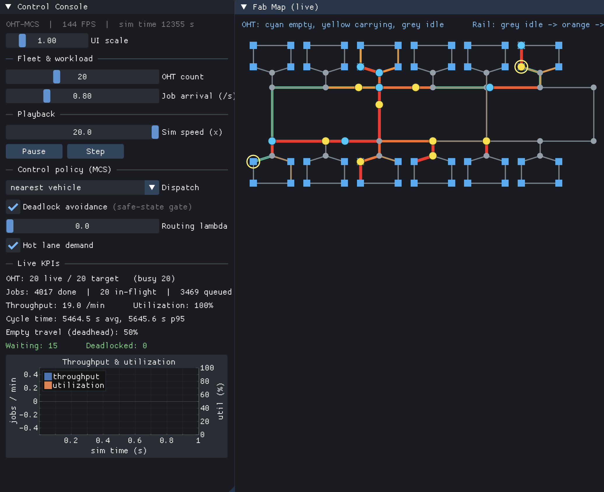
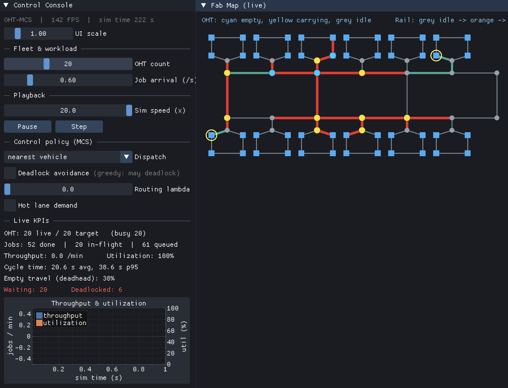
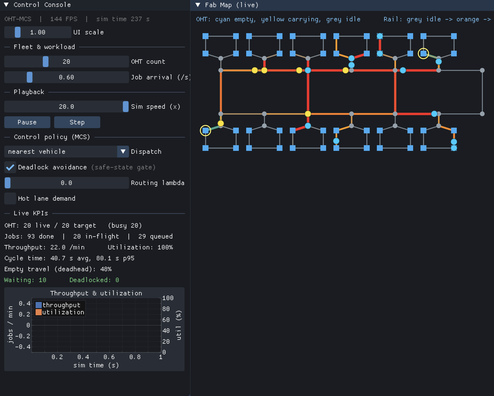
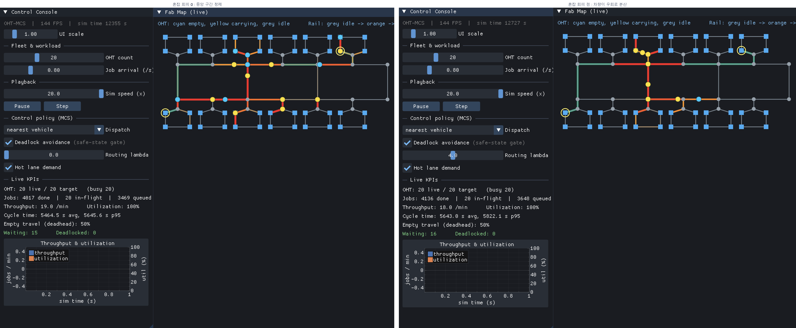

<h1 align="center">OHT-MCS Simulator</h1>

<p align="center">반도체 공장의 무인 반송차(OHT)와 반송제어(MCS)를 시뮬레이션하는 C++ 프로그램</p>

<p align="center">
  
</p>

반도체 공장의 천장 레일을 달리는 무인 반송차(OHT)와 이를 지휘하는 반송제어 시스템(MCS)을 작은 규모로 구현했습니다. 슬라이더로 차 대수나 부하를 바꾸면 차들이 레일 위를 실제처럼 움직이고, 처리량과 가동률 같은 지표가 실시간으로 바뀝니다.

> 차량 색: 청록(빈 차) / 노랑(운반 중) / 회색(대기) · 레일 색: 회색(한산) → 주황 → 빨강(혼잡)

## 주요 기능

- 레일 위 반송차와 구간 혼잡도를 실시간 색상으로 시각화
- 차 대수, 작업 발생량, 배속을 슬라이더로 즉시 조절
- 배차 정책 3종을 실행 중에 전환해 비교
- 교착 회피 켜기/끄기
- 혼잡한 구간을 피해 우회하는 경로 선택
- 화면 없이 빠르게 돌리는 배치 실험 모드 (CSV 출력)

## 스크린샷

교착 회피를 끄면 차들이 서로 막혀 멈추고, 켜면 안전 상태 검사로 정상 운행합니다.

<table>
<tr>
<td width="50%"></td>
<td width="50%"></td>
</tr>
<tr>
<td align="center">교착 회피 끔</td>
<td align="center">교착 회피 켬</td>
</tr>
</table>

혼잡한 구간(왼쪽, 빨강)에서 혼잡 회피를 켜면 차들이 다른 길로 우회합니다(오른쪽).



## 빌드와 실행

요구 사항: C++17 컴파일러, CMake 3.16 이상. 의존성(GLFW, Dear ImGui, ImPlot)은 CMake가 자동으로 받아옵니다.

```bash
cmake -S . -B build -G Ninja
cmake --build build
./build/oht_mcs_simulator
```

화면 없이 데이터만 뽑는 헤드리스 모드:

```bash
./build/oht_mcs_simulator --sweep      # 차 대수 스윕
./build/oht_mcs_simulator --deadlock   # 교착 회피 검증
./build/oht_mcs_simulator --bench      # 배차 정책 비교
./build/oht_mcs_simulator --route      # 혼잡 라우팅 스윕
./build/oht_mcs_simulator --little     # 리틀의 법칙 검증
```

## 조작법

| 컨트롤 | 설명 |
|---|---|
| OHT count | 반송차 대수 |
| Job arrival /s | 초당 작업 발생 수 (공장 부하) |
| Sim speed x | 시뮬레이션 배속 |
| Dispatch | 배차 방식 선택 |
| Deadlock avoidance | 교착 회피 켜기/끄기 |
| Routing lambda | 혼잡 회피 가중치 |
| Hot lane demand | 특정 구간에 수요 집중 |

## 동작 방식

- **교착 회피**: 각 구간을 용량 1 자원으로 보고 진입 전에 예약합니다. 진입 직전 은행원 알고리즘과 같은 안전 상태 검사로, 그 차가 들어가도 남은 모든 차가 경로를 끝낼 순서가 있는지 확인해 교착을 사전에 막습니다.
- **배차**: 대기 작업과 유휴 차량의 모든 (차, 작업) 쌍을 경로 거리로 정렬해, 빈 차 이동이 가장 짧은 쌍부터 맞추는 전역 탐욕 매칭입니다. 정책은 전략 패턴으로 분리해 실행 중에 교체할 수 있습니다.
- **경로 선택**: 구간 혼잡도를 비용에 반영한 가중 Dijkstra 최단경로입니다. 비용 = 거리 × (1 + λ × 혼잡도)로, λ가 클수록 혼잡한 구간을 강하게 피해 우회합니다.
- **구조**: 렌더링과 분리된 단일 시뮬레이션 코어를 실시간 콘솔과 배치 실험 모드가 공유하며, 고정 시간 간격으로 상태를 갱신합니다.

## 기술 스택

C++17, CMake, Dear ImGui, ImPlot, GLFW, OpenGL
